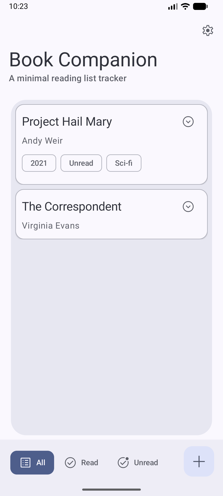
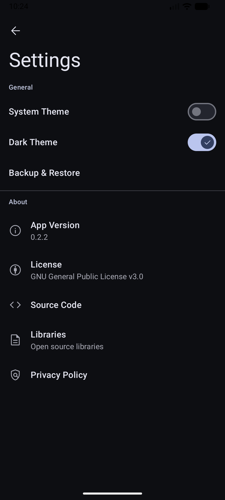
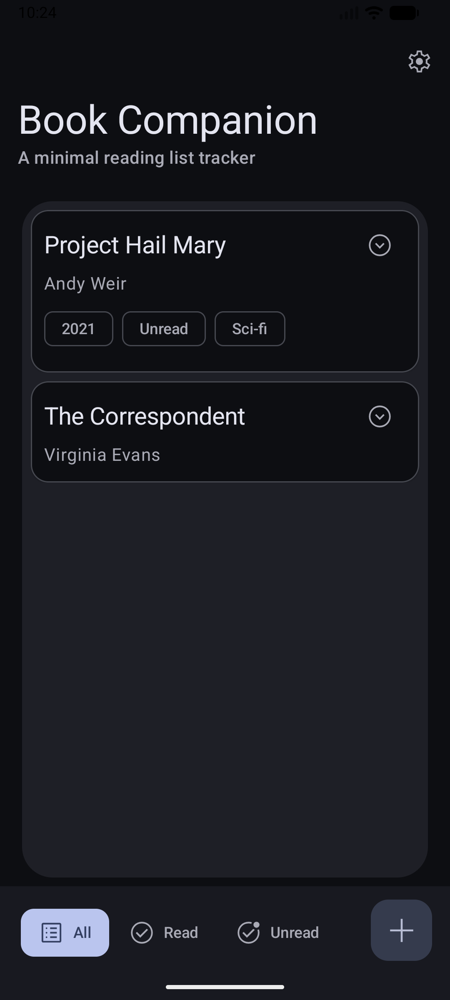
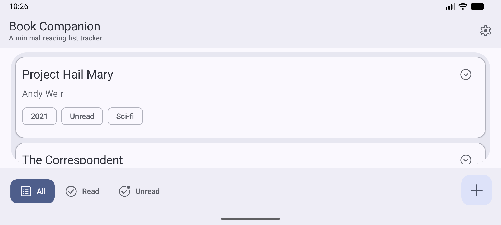
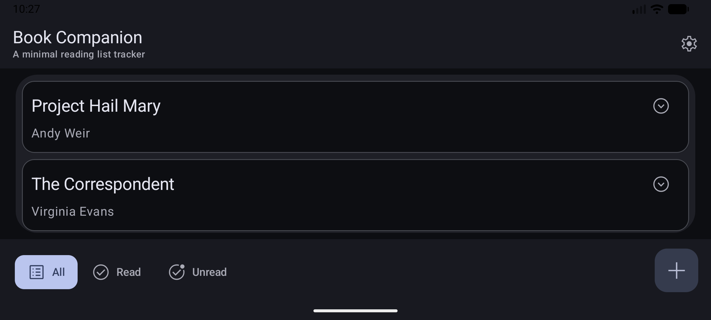

<div align="center">
  
  <h1>Books Companion</h1>
</div>

<p align="center">
  
  <a href="https://github.com/mukund-yedunuthala/BooksCompanionApp/actions/workflows/gradle-publish.yml">
    
  </a>
</p>

This is one of many open source book trackers available for Android, still a work-in-progress. 
Hobby project, built entirely on Jetpack compose.

## Screenshots
### Portrait Mode Screenshots
<div align="center">
  
  
  
</div>

### Landscape Mode Screenshots
<div align="center">
  
  
</div>

## Installation

Currently no public releases are available. Pre-release versions are available [here](https://github.com/mukund-yedunuthala/BooksCompanionApp/releases).

## What works
- CRUD operations 
- Exporting and Importing database

## Development
- Written entirely using Jetpack Compose and Kotlin.
- Hilt for dependency injection. 
- AndroidX Room, Lifecycle, Navigation architecture components are being used.
- Material 3 (You) theming.

## Roadmap
- More theming options.
- Implement data fields such as tags, description
- Implement sorting
- Tablet optimization

## License 

``` 
Copyright (C) 2023  Mukund Yedunuthala

    This program is free software: you can redistribute it and/or modify
    it under the terms of the GNU General Public License as published by
    the Free Software Foundation, either version 3 of the License, or
    (at your option) any later version.

    This program is distributed in the hope that it will be useful,
    but WITHOUT ANY WARRANTY; without even the implied warranty of
    MERCHANTABILITY or FITNESS FOR A PARTICULAR PURPOSE.  See the
    GNU General Public License for more details.

    You should have received a copy of the GNU General Public License
    along with this program.  If not, see <https://www.gnu.org/licenses/>
