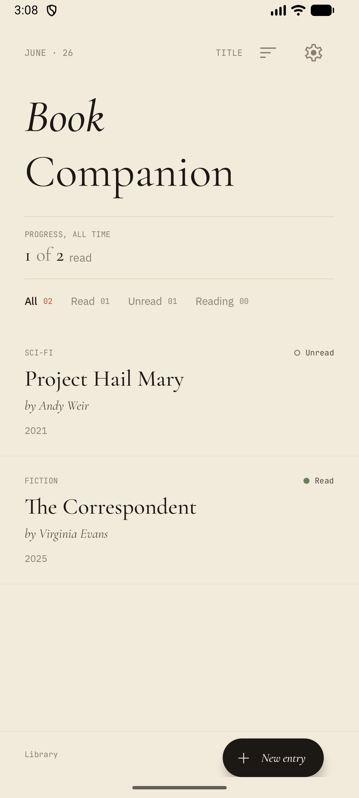
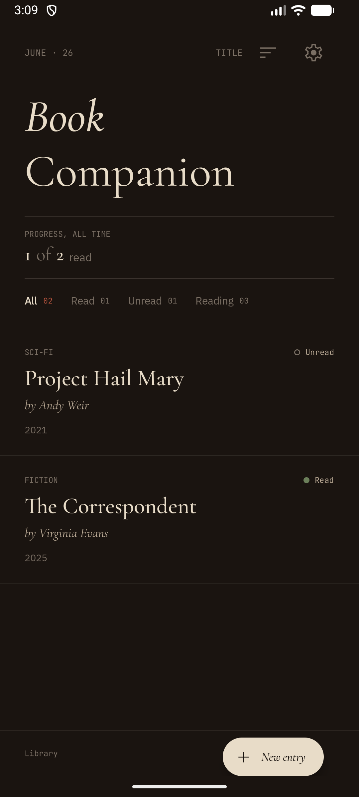
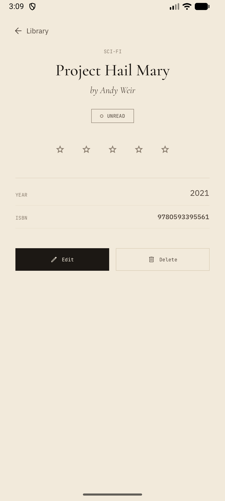
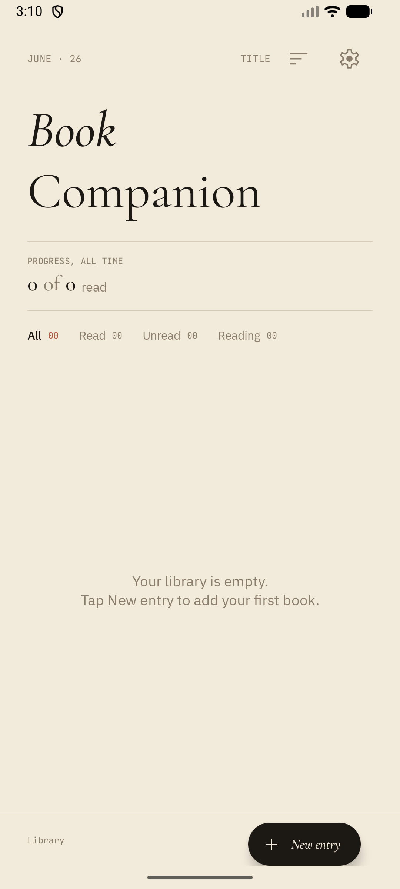
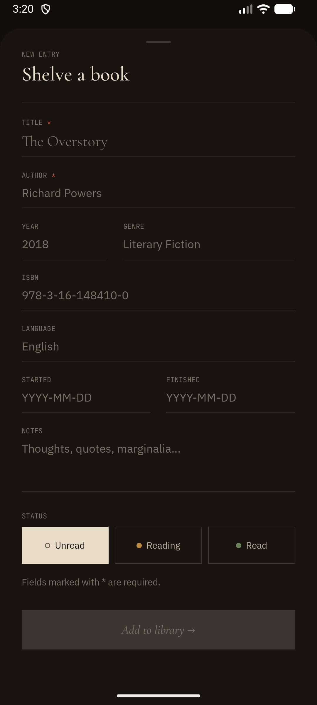
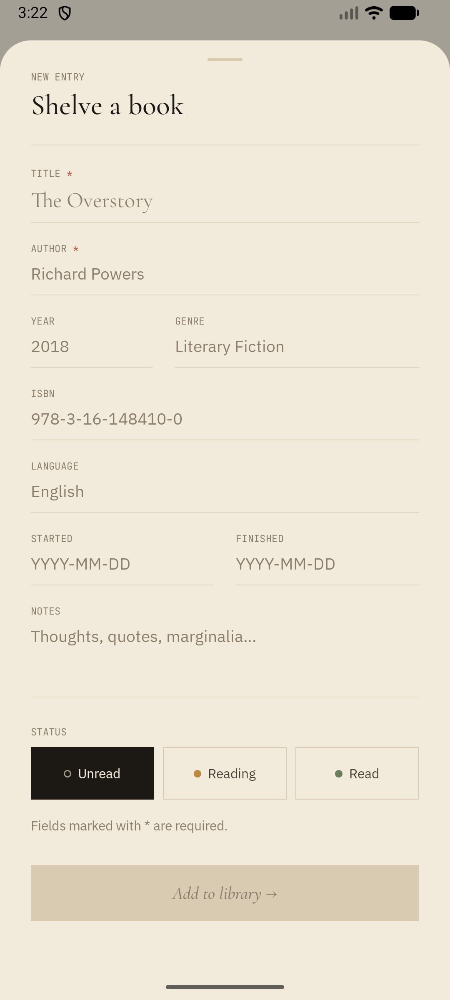

<div align="center">
  
  <h1>Book Companion</h1>
</div>

[](https://ai-declaration.md)

<p align="center">
  
  <a href="https://github.com/mukund-yedunuthala/BooksCompanionApp/actions/workflows/gradle-publish.yml">
    
  </a>
</p>

Book Companion is a local Android app for keeping track of your reading library. It is a hobby project and remains a work in progress.

## Screenshots

<div align="center">
  
  
  
  
  
  
</div>

## Features

- Add, edit, and delete books; track title, author, year, genre, ISBN, language, notes, dates, status, and a 1–5 star rating.
- Browse books by status (all, read, unread, or reading) and sort by title or year.
- Use the system theme or choose light or dark mode.
- Export the local library to JSON and restore it later.

## Build from source

Requires Android Studio with JDK 17 and an Android device or emulator running Android 12 (API 31) or newer.

```bash
./gradlew assembleDebug
```

The debug APK is written to `app/build/outputs/apk/debug/app-debug.apk`.

## Development

The app is written in Kotlin with Jetpack Compose, Material 3, Room, Hilt, DataStore, and Navigation Compose.

## Roadmap

- Tablet optimization.
- Public releases.

## License

Copyright (C) 2026 Mukund Yedunuthala. Licensed under the [GNU General Public License v3.0](LICENSE).
